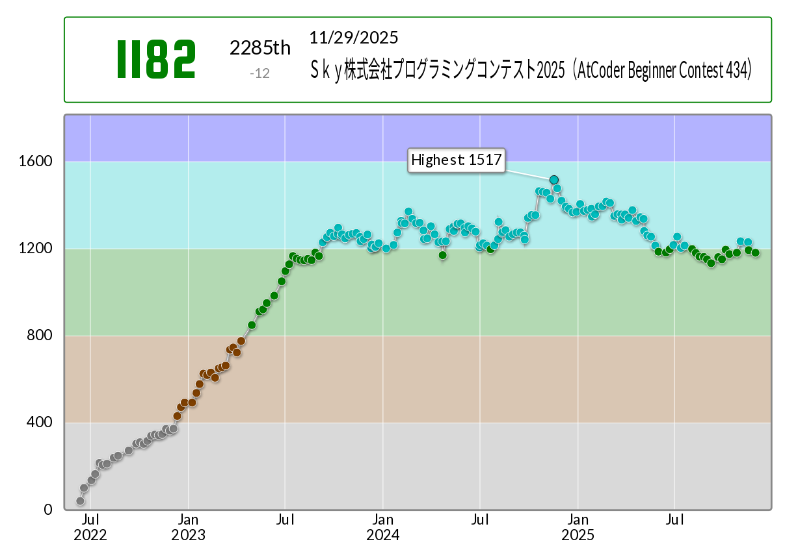

#+TITLE: AtCoder 用テンプレートの紹介 (Haskell)
#+DATE: <2025-12-02 Tue>
#+FILETAGS: :atcoder:haskell:
#+THUMBNAIL: img/2025-12-02-graph.png

この記事は [[https://qiita.com/advent-calendar/2025/haskell][Haskell Advent Calendar 2025]] の 2 日目の投稿です。

前回の投稿は nobsun の『[[https://zenn.dev/nobsun/articles/previous-permutation][直前の順列]]』でした。

* 背景

** 参加者の推移

Haskell で AtCoder を始めて四年目になりました。現在は、毎週開催の『AtCoder Beginner Contest』に参加する Haskeller の数が 10 名を超えており、若干メンバーが入れ替わりつつも最盛期と言えそうです。

** 僕の現状

僕の成績のピークは一年前です。上を見ていた頃と比べると、残念ながら腕前は落ちています:

#+ATTR_HTML: :width 603px

とはいえテンプレートは十分に枯れた頃ですので、改めて主なテンプレートを紹介します。

* テンプレート紹介

僕のライブラリは [[https://github.com/toyboot4e/toy-lib][=toy-lib=]] です。 AtCoder の提出では、このライブラリからコードを取り出して =Main.hs= に入れています (後述の bundler) 。

** =debug= フラグ

AtCoder 環境では環境変数 =ATCODER= が定義されています。 =ATCODER= 定義の有無を判定し、 =debug= 変数に保存します:

#+BEGIN_SRC hs
{-# LANGUAGE CPP #-}

import Debug.Trace

#ifdef ATCODER
debug :: Bool ; debug = False
#else
debug :: Bool ; debug = True
#endif
#+END_SRC

=debug= 変数を使って、ローカル環境でのみ動作するデバッグ出力用の関数を定義しています:

#+BEGIN_SRC hs
dbg :: (Show a) => a -> ()
dbg x
  | debug = let !_ = traceShow x () in ()
  | otherwise = ()

dbgId :: (Show a) => a -> a
dbgId x
  | debug = let !_ = traceShow x () in x
  | otherwise = x
#+END_SRC

#+BEGIN_QUOTE
正格評価と使い方については [[https://zenn.dev/toyboot4e/books/seriously-haskell/viewer/2-1-stderr][[2-1] stderr にデバッグ出力｜AtCoder ガチ言語 Haskell 🔥]] をご参照ください。この章はちゃんと書いていたはず……。
#+END_QUOTE

** 累積和、区間和

累積和 (prefix sum) を事前計算しておくと、 $[l, r]$ 区間の和を $S[r + 1] - S[l]$ により $O(1)$ で計算できます。この区間和の計算を =(+!)= 演算子にしています:

#+BEGIN_SRC hs
import Data.Vector.Generic qualified as G
import Data.Vector.Unboxed qualified as U
import GHC.Stack (HasCallStack)

{-# INLINE csum1D #-}
csum1D :: (Num a, U.Unbox a) => U.Vector a -> U.Vector a
csum1D = U.scanl' (+) 0

{-# INLINE (+!) #-}
(+!) :: (HasCallStack, Num a, U.Unbox a) => U.Vector a -> (Int, Int) -> a
(+!) csum (!l, !r) = csum G.! (r + 1) - csum G.! l -- (ref:1)
#+END_SRC

- [[(1)]] =vector= では =Data.Vector.Generic= にのみ =HasCallStack= 制約がついているため、 =G.!= を使った方が良いです

** =index'=

[[https://hackage.haskell.org/package/base-4.21.0.0/docs/Data-Ix.html#v:index][=Data.Ix.index=]] には [[https://hackage.haskell.org/package/base-4.21.0.0/docs/GHC-Stack.html#t:HasCallStack][=HasCallStack=]] 制約が無いため、エラー時の情報に乏しいです。エラー表示は以下のようになります:

#+BEGIN_SRC txt
a-exe: Error in array index
#+END_SRC

より詳細なエラー表示をしてくれる =index= 関数は以下となります:

#+BEGIN_SRC hs
import Data.Ix
import GHC.Stack (HasCallStack)

{-# INLINE index' #-}
index' :: (HasCallStack, Ix i, Show i) => (i, i) -> i -> Int
index' !bnd !i
  | inRange bnd i = index bnd i
  | otherwise = error $ "index out ouf bounds: " ++ show i ++ " in " ++ show bnd
#+END_SRC

次のように表示してくれて助かります:

#+BEGIN_SRC txt
a-exe: index out ouf bounds: (-1,-1) in ((0,0),(4,4))
CallStack (from HasCallStack):
  error, called at src/Data/Vector/IxVector.hs:30:17 in toy-lib-0.1.0.0-inplace:Data.Vector.IxVector
  index', called at a/Main.hs:35:12 in abc434-0.1.0.0-inplace-a-exe:Main
#+END_SRC

** 2 次元 or 3 次元 vector

[[https://hackage.haskell.org/package/vector][=vector=]] パッケージは 1 次元配列を提供します。 =vector= をラップすると、 [[https://zenn.dev/naoya_ito/articles/87a8a21d52c302][=array=]] 似の多次元配列の API を提供できます。

#+BEGIN_SRC hs
import Control.Monad.Primitive
import Data.Ix
import Data.Vector.Generic qualified as G
import Data.Vector.Unboxed qualified as U
import GHC.Stack (HasCallStack)

data IxVector i v = IxVector {boundsIV :: !(i, i), vecIV :: !v}
  deriving (Show, Eq)

-- Immutable な IxVector の値を読む
{-# INLINE (@!) #-}
(@!) :: (HasCallStack, Ix i, Show i, G.Vector v a) => IxVector i (v a) -> i -> a
(@!) IxVector {..} i = vecIV G.! index' boundsIV i

-- Mutable な IxVector の値を読む
{-# INLINE readIV #-}
readIV :: (HasCallStack, Ix i, Show i, PrimMonad m, GM.MVector v a) => IxVector i (v (PrimState m) a) -> i -> m a
readIV IxVector {..} i = GM.read vecIV (index' boundsIV i)
#+END_SRC

行列やグリッドの読み込みでも、上記の =IxVector= 型を返すようにしています (後述):

#+BEGIN_SRC hs
matP :: (MonadState BS.ByteString m) => Int -> Int -> m (IxVector (Int, Int) (U.Vector Int))
matP h w = IxVector ((0, 0), (h - 1, w - 1)) <$> U.replicateM (h * w) intP

gridP :: (MonadState BS.ByteString m) => Int -> Int -> m (IxVector (Int, Int) (U.Vector Char))
gridP h w = IxVector ((0, 0), (h - 1, w - 1)) <$> U.replicateM (h * w) charP
#+END_SRC

完全にガラパゴスなのが珠に瑕ですが、 [[https://hackage.haskell.org/package/massiv][=massiv=]] と比較して軽量で無難な選択肢だと思います。

** スニペット

=err= を =error "unreachable"= に展開するスニペットを使っています。また =inl= を ={-# INLINE _ #-}= に展開するスニペットも使っています。

その他は全て手打ちですが、 =->= を簡単に (自動的に) 入力してくれる仕組みが必要だと感じています。

** 入力

標準入力は、概ね以下のように読み込んでいます:

#+BEGIN_SRC hs
import Control.Monad.State.Class
import Control.Monad.State.Strict
import Data.ByteString.Char8 qualified as BS
import Data.Maybe (fromJust)

{-# INLINE intP #-}
intP :: (MonadState BS.ByteString m) => m Int
intP = state $ fromJust . BS.readInt . BS.dropSpace -- (ref:1)

ints2P :: (MonadState BS.ByteString m) => m (Int, Int)
ints2P = (,) <$> intP <*> intP -- (ref:2)

solve :: StateT BS.ByteString IO () -- (ref:3)
solve = do
  (!a, !b) <- ints2P
  -- ..

main :: IO ()
main = evalStateT solve =<< BS.getContents -- (ref:4)
#+END_SRC

- [[(1)]] =BS.readInt= などは =State= モナドで包み直しています
- [[(2)]] パーサを元に別のパーサを作ります
- [[(3)]] 解答プログラムの型は =StateT BS.ByteString IO ()= です
- [[(4)]] 解答プログラムの状態に標準入力全体を渡しています

*** =State= モナドの有用性

=State= モナド無しでパーサを定義すると、以下のように状態を引き回すことになって大変です:

#+BEGIN_SRC hs
import Data.ByteString.Char8 qualified as BS
import Data.Maybe (fromJust)

{-# INLINE ints2 #-}
ints2 :: BS.ByteString -> ((Int, Int), BS.ByteString)
ints2 bs0 =
  let (i1, bs1) = fromJust . BS.readInt $ BS.dropSpace bs0
      (i2, bs2) = fromJust . BS.readInt $ BS.dropSpace bs1
   in ((i1, i2), bs2)
#+END_SRC

*** インタラクティブ問題の場合

インタラクティブ問題で =BS.getContents= を呼ぶと、永久に制御が帰ってこなくなります。したがって =BS.getLine= で読み込んだ各行に対してパーサを適用しています。

ヘルパ関数の =withLine= を定義しています:

#+BEGIN_SRC hs
{-# INLINE withLine #-}
withLine :: (MonadIO m) => State BS.ByteString a -> m a
withLine f = evalState f <$> liftIO BS.getLine

main :: IO ()
main = do
  (a, b) <- withLine ints2P
  -- ..
#+END_SRC

この辺りは [[https://booth.pm/ja/items/1577541][Haskellで戦う競技プログラミング 第2版]] でも触れられていたように思います。バイブルですね。

その他、詳しくは [[https://zenn.dev/toyboot4e/books/kyopro-bonsai-hs/viewer/parser][State ベースのパーサ｜競プロ盆栽.hs]] で解説しています。あちらではパーサが =Maybe BS.ByteString= を返すようになっています。

** 出力

標準出力には [[https://hackage-content.haskell.org/package/bytestring-0.12.2.0/docs/Data-ByteString-Builder.html][Data.ByteString.Builder]] を使っています。文字列を貪欲に結合すると $O(|S|^2)$ の処理になりますが、 =Builder= は概ね連結リストらしく、 $O(|S|)$ で出力できます。

=Builder= に変換するための型クラスを定義しています:

#+BEGIN_SRC hs
class ShowBSB a where
  showBSB :: a -> BSB.Builder
  {-# INLINE showBSB #-}
  default showBSB :: (Show a) => a -> BSB.Builder
  showBSB = BSB.string8 . show

instance ShowBSB Int where
  {-# INLINE showBSB #-}
  showBSB = BSB.intDec

instance ShowBSB Double where
  {-# INLINE showBSB #-}
  showBSB = BSB.doubleDec

-- ..
#+END_SRC

これを使って、何でも =printBSB= できるようにしています:

#+BEGIN_SRC hs
{-# INLINE putLnBSB #-}
putLnBSB :: (MonadIO m) => BSB.Builder -> m ()
putLnBSB = liftIO . BSB.hPutBuilder stdout . (<> endlBSB)

{-# INLINE showLnBSB #-}
showLnBSB :: (ShowBSB a) => a -> BSB.Builder
showLnBSB = (<> endlBSB) . showBSB

{-# INLINE printBSB #-}
printBSB :: (ShowBSB a, MonadIO m) => a -> m ()
printBSB = putBSB . showLnBSB
#+END_SRC

** Bundler について

巨大な提出ファイルはコンパイルに時間がかかりますから、必要なモジュールのみを提出ファイルに含めたいものです。 =toy-lib= はこのような bundler の機能を持っています。

*** ファイル形式

例えば以下の =Main.hs= ファイルがあるとします:

#+BEGIN_SRC hs
-- {{{ toy-lib import
import ToyLib.Prelude
-- }}} toy-lib import

main :: IO ()
main = putStrLn "Hello, world!"
#+END_SRC

*** Bundling の実施

これを =toy-lib= (実行ファイル) にかけると、 =import ToyLib.Prelude= の部分が =src/ToyLib/Prelude.hs= および =Prelude.hs= の依存ファイルの内容に置換されます:

#+BEGIN_SRC sh
$ toy-lib -e Main.hs > Main2.hs
embedding the following toy-lib source files:
- Data/Core/Unindex.hs
- ToyLib/Prelude.hs
#+END_SRC

置換後のファイル内容は次の通りです:

#+BEGIN_SRC hs
$ cat Main2.hs
class (Ix i, U.Unbox i) => Unindex i where { unindex :: (i, i) -> Int -> i};instance Unindex Int where { {-# INLINE unindex #-}; unindex _ !v = v};instance Unindex (Int, Int) where { {-# INLINE unindex #-}; unindex ((!y0, !x0), (!_, !x1)) !yx = let { !w = x1 - x0 + 1; (!dy, !dx) = yx `quotRem` w} in (y0 + dy, x0 + dx)};instance Unindex (Int, Int, Int) where { {-# INLINE unindex #-}; unindex ((!z0, !y0, !x0), (!_, !y1, !x1)) !zyx = let { !h = y1 - y0 + 1; !w = x1 - x0 + 1; (!dz, !yx) = zyx `quotRem` (h * w); (!dy, !dx) = yx `quotRem` w} in (z0 + dz, y0 + dy, x0 + dx)};instance Unindex (Int, Int, Int, Int) where { {-# INLINE unindex #-}; unindex ((!b3, !b2, !b1, !b0), (!_, !x2, !x1, !x0)) !pos3 = let { !w2 = x2 - b2 + 1; !w1 = x1 - b1 + 1; !w0 = x0 - b0 + 1; (!y3, !pos2) = pos3 `quotRem` (w2 * w1 * w0); (!y2, !pos1) = pos2 `quotRem` (w1 * w0); (!y1, !y0) = pos1 `quotRem` w0} in (b3 + y3, b2 + y2, b1 + y1, b0 + y0)};instance Unindex ((Int, Int), (Int, Int)) where { {-# INLINE unindex #-}; unindex (((!b3, !b2), (!b1, !b0)), ((!_, !x2), (!x1, !x0))) !pos3 = let { !w2 = x2 - b2 + 1; !w1 = x1 - b1 + 1; !w0 = x0 - b0 + 1; (!y3, !pos2) = pos3 `quotRem` (w2 * w1 * w0); (!y2, !pos1) = pos2 `quotRem` (w1 * w0); (!y1, !y0) = pos1 `quotRem` w0} in ((b3 + y3, b2 + y2), (b1 + y1, b0 + y0))};{-# INLINE rleOf #-};rleOf :: BS.ByteString -> [(Char, Int)];rleOf = map (\ s -> (BS.head s, BS.length s)) . BS.group;{-# INLINE rleOfU #-};rleOfU :: BS.ByteString -> U.Vector (Char, Int);rleOfU = U.fromList . rleOf;{-# INLINE square #-};square :: (Num a) => a -> a;square !x = x * x;{-# INLINE isqrt #-};isqrt :: Int -> Int;isqrt = round @Double . sqrt . fromIntegral;{-# INLINE (.:) #-};(.:) :: (b -> c) -> (a1 -> a2 -> b) -> (a1 -> a2 -> c);(.:) = (.) . (.);{-# INLINE swapDupeU #-};swapDupeU :: U.Vector (Int, Int) -> U.Vector (Int, Int);swapDupeU = U.concatMap (\ (!u, !v) -> U.fromListN 2 [(u, v), (v, u)]);{-# INLINE swapDupeW #-};swapDupeW :: (U.Unbox w) => U.Vector (Int, Int, w) -> U.Vector (Int, Int, w);swapDupeW = U.concatMap (\ (!u, !v, !d) -> U.fromListN 2 [(u, v, d), (v, u, d)]);{-# INLINE ortho4 #-};ortho4 :: U.Vector (Int, Int);ortho4 = U.fromList [(0, 1), (0, -1), (1, 0), (-1, 0)];{-# INLINE ortho4' #-};ortho4' :: ((Int, Int), (Int, Int)) -> (Int, Int) -> U.Vector (Int, Int);ortho4' bnd base = U.filter (inRange bnd) $ U.map (add2 base) ortho4;{-# INLINE orthoWith #-};orthoWith :: ((Int, Int), (Int, Int)) -> ((Int, Int) -> Bool) -> (Int -> U.Vector Int);orthoWith bnd p v1 = U.map (index bnd) . U.filter ((&&) <$> inRange bnd <*> p) $ U.map (add2 (unindex bnd v1)) ortho4;{-# INLINE diag4 #-};diag4 :: U.Vector (Int, Int);diag4 = U.fromList [(-1, 1), (1, 1), (1, -1), (-1, -1)];{-# INLINE slice #-};slice :: (G.Vector v a) => Int -> Int -> v a -> v a;slice !l !r !vec = G.slice l (max 0 (r - l + 1)) vec;{-# INLINE zero2 #-};zero2 :: Int -> Int -> ((Int, Int), (Int, Int));zero2 n1 n2 = ((0, 0), (n1 - 1, n2 - 1));{-# INLINE zero3 #-};zero3 :: Int -> Int -> Int -> ((Int, Int, Int), (Int, Int, Int));zero3 n1 n2 n3 = ((0, 0, 0), (n1 - 1, n2 - 1, n3 - 1));{-# INLINE rangeG #-};rangeG :: (G.Vector v Int) => Int -> Int -> v Int;rangeG !i !j = G.enumFromN i (succ j - i);{-# INLINE rangeV #-};rangeV :: Int -> Int -> V.Vector Int;rangeV = rangeG;{-# INLINE rangeU #-};rangeU :: Int -> Int -> U.Vector Int;rangeU = rangeG;{-# INLINE rangeGR #-};rangeGR :: (G.Vector v Int) => Int -> Int -> v Int;rangeGR !i !j = G.enumFromStepN j (-1) (succ j - i);{-# INLINE rangeVR #-};rangeVR :: Int -> Int -> V.Vector Int;rangeVR = rangeGR;{-# INLINE rangeUR #-};rangeUR :: Int -> Int -> U.Vector Int;rangeUR = rangeGR;{-# INLINE times #-};times :: Int -> (a -> a) -> a -> a;times !n !f = inner 0 where { inner i !s | i >= n = s | otherwise = inner (i + 1) $! f s};interleave :: [a] -> [a] -> [a];interleave xs [] = xs; interleave [] ys = ys; interleave (x : xs) (y : ys) = x : y : interleave xs ys;combs :: Int -> [a] -> [[a]];combs _ [] = []; combs k as@(!(_ : xs)) | k == 0 = [[]] | k == 1 = map pure as | k == l = pure as | k > l = [] | otherwise = run (l - 1) (k - 1) as $ combs (k - 1) xs where { l = length as; run :: Int -> Int -> [a] -> [[a]] -> [[a]]; run n k ys cs | n == k = map (ys ++) cs | otherwise = map (q :) cs ++ run (n - 1) k qs (drop dc cs) where { (!(q : qs)) = take (n - k + 1) ys; dc = product [(n - k + 1) .. (n - 1)] `div` product [1 .. (k - 1)]}};{-# INLINE swapDupe #-};swapDupe :: (a, a) -> [(a, a)];swapDupe (!x1, !x2) = [(x1, x2), (x2, x1)];{-# INLINE add2 #-};add2 :: (Int, Int) -> (Int, Int) -> (Int, Int);add2 (!y, !x) = bimap (y +) (x +);{-# INLINE sub2 #-};sub2 :: (Int, Int) -> (Int, Int) -> (Int, Int);sub2 (!y, !x) = bimap (y -) (x -);{-# INLINE mul2 #-};mul2 :: Int -> (Int, Int) -> (Int, Int);mul2 !m = both (m *);{-# INLINE add3 #-};add3 :: (Int, Int, Int) -> (Int, Int, Int) -> (Int, Int, Int);add3 (!z1, !y1, !x1) (!z2, !y2, !x2) = (z1 + z2, y1 + y2, x1 + x2);{-# INLINE sub3 #-};sub3 :: (Int, Int, Int) -> (Int, Int, Int) -> (Int, Int, Int);sub3 (!z1, !y1, !x1) (!z2, !y2, !x2) = (z1 - z2, y1 - y2, x1 - x2);{-# INLINE mul3 #-};mul3 :: (Int, Int, Int) -> (Int, Int, Int) -> (Int, Int, Int);mul3 (!z1, !y1, !x1) (!z2, !y2, !x2) = (z1 - z2, y1 - y2, x1 - x2);{-# INLINE toRadian #-};toRadian :: Double -> Double;toRadian degree = degree / 180.0 * pi;{-# INLINE toDegree #-};toDegree :: Double -> Double;toDegree rad = rad / pi * 180.0;{-# INLINE fst4 #-};fst4 :: (a, b, c, d) -> a;fst4 (!a, !_, !_, !_) = a;{-# INLINE snd4 #-};snd4 :: (a, b, c, d) -> b;snd4 (!_, !b, !_, !_) = b;{-# INLINE thd4 #-};thd4 :: (a, b, c, d) -> c;thd4 (!_, !_, !c, !_) = c;{-# INLINE fth4 #-};fth4 :: (a, b, c, d) -> d;fth4 (!_, !_, !_, !d) = d;{-# INLINE first4 #-};first4 :: (a -> x) -> (a, b, c, d) -> (x, b, c, d);first4 f (!a, !b, !c, !d) = (f a, b, c, d);{-# INLINE second4 #-};second4 :: (b -> x) -> (a, b, c, d) -> (a, x, c, d);second4 f (!a, !b, !c, !d) = (a, f b, c, d);{-# INLINE third4 #-};third4 :: (c -> x) -> (a, b, c, d) -> (a, b, x, d);third4 f (!a, !b, !c, !d) = (a, b, f c, d);{-# INLINE fourth4 #-};fourth4 :: (d -> x) -> (a, b, c, d) -> (a, b, c, x);fourth4 f (!a, !b, !c, !d) = (a, b, c, f d);fix1 :: a -> ((a -> b) -> a -> b) -> b;fix1 a f = fix f a;fix2 :: a -> b -> ((a -> b -> c) -> a -> b -> c) -> c;fix2 a b f = fix f a b;fix3 :: a -> b -> c -> ((a -> b -> c -> d) -> a -> b -> c -> d) -> d;fix3 a b c f = fix f a b c

main :: IO ()
main = putStrLn "Hello, world!"
#+END_SRC

置換後のファイルを AtCoder に提出しています ([[https://atcoder.jp/contests/abc434/submissions/71359707][例]]) 。

*** Bundler の実装方法

現在は Haskeller 向けの汎用の bundler が無いように思います。作っていなくてすみません。

気になる方は [[https://github.com/toyboot4e/toy-lib][=toy-lib=]] の =app= モジュール等をご参照ください。また上の例のように、テンプレートを 1 行にフォーマットしなくて良い場合には、 =@cojna= さんの [[https://github.com/cojna/iota][=iota=]] をご覧ください。

** ac-library-hs

ライブラリの大半を [[https://hackage.haskell.org/package/ac-library-hs][ac-library-hs]] に移行したため、 =import= して使っています。

* まとめ

AtCoder 用のテンプレートを紹介しました。数年前の投稿からそこまで変わっておらず、デバッグ出力、多次元配列、入出力があれば概ね十分な気がします。

現在のスタイルが安定するまでに、主に以下の本・リポジトリから影響を受けました。いつもお世話になっています:

- [[https://booth.pm/ja/items/1577541][Haskellで戦う競技プログラミング 第2版]]
- [[https://github.com/cojna/iota][cojna/iota]]

-----

明日の投稿は mr\under{}konn さんの『HaskellerとRustaceanが知恵をあわせてプロダクトを3日で1000倍高速化した話』です。今年も超大作なのでしょうか。楽しみです！

