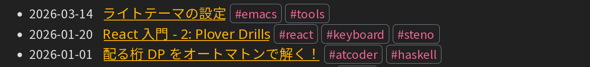
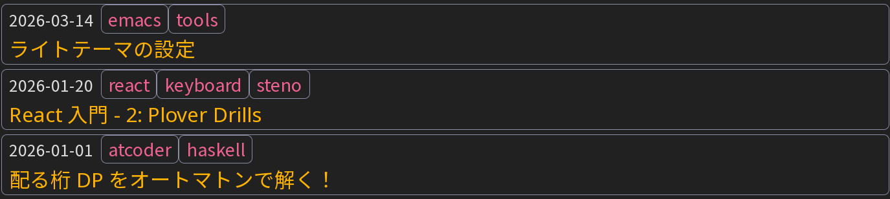
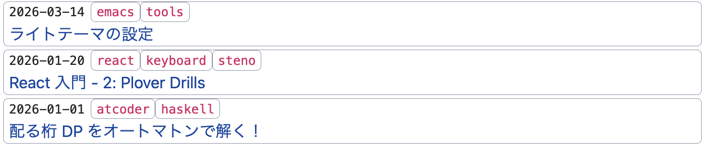

#+TITLE: =org-mode= 製ブログの改良 (7): 記事カード
#+DATE: <2026-03-14 Sat>
#+FILETAGS: :blog:

* 背景

このブログのトップページは、記事一覧が格好悪いと思っていました:

#+CAPTION: リスト表示

[[https://technicalsuwako.moe/][人のブログ]] を見ると、やはりカード風の表示が良いですね。

* 結果

** カード表示

記事のカード表示を実装してみました。記事のタイトルが左寄せになったため、視認性が改善したと思います:

#+CAPTION: カード表示

タグがスペースを取り過ぎているため、まだ調整が必要かとは思います。

** ライトテーマ

別件ですが、 OS の設定に応じて [[https://simplecss.org/][Simple.css]] のライトテーマが表示するように変更しました (ダークテーマの強制を解除しました):

#+CAPTION: カード表示 (ライトテーマ)

Prism.js によるコードスタイルも、 light/dark 両対応にしました:

#+BEGIN_SRC html
<link rel="stylesheet" href="/style/prism-light.css" media="(prefers-color-scheme: light)">
<link rel="stylesheet" href="/style/prism-dark.css" media="(prefers-color-scheme: dark)">
#+END_SRC

* まとめ

ブログのビルドスクリプトを更新しました。 Emacs Lisp の修正に乗り気になれなかったのですが、今回から記事の情報を [[https://www.gnu.org/software/emacs/manual/html_node/elisp/Property-Lists.html][=plist=]] として持つようにしたため、気軽に改造できるようになりました。

#+BEGIN_SRC elisp
;; ある種オブジェクトのように扱えます
(plist-get article :title)
(plist-get article :date)

;; 今までは、何とタプルで頑張っていました (酷い！)
#+END_SRC
