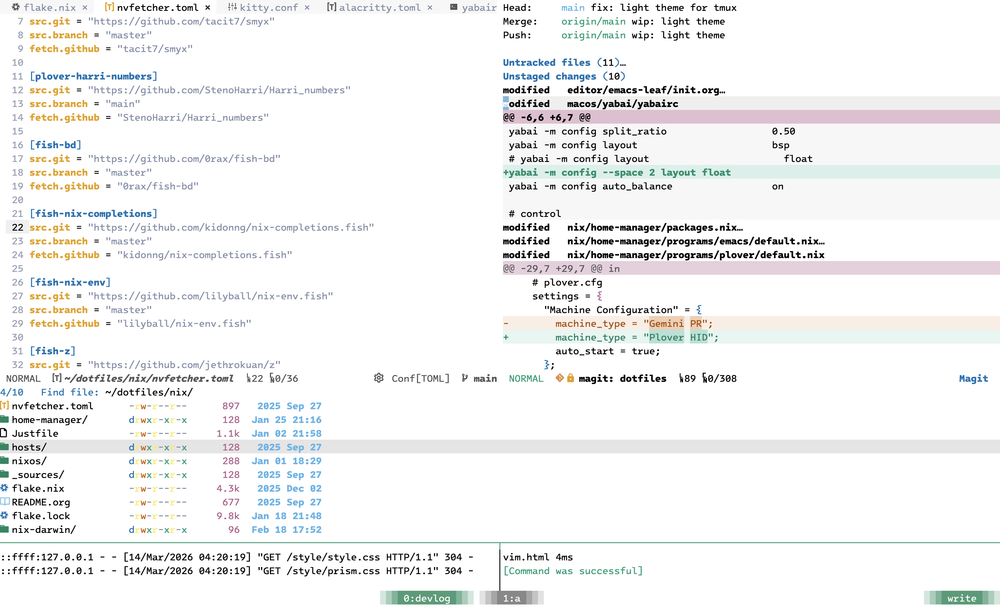
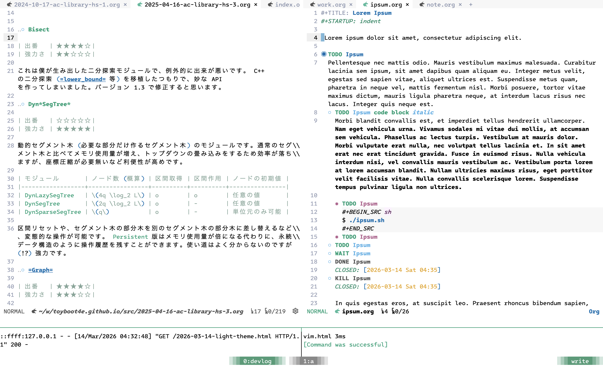

#+TITLE: ライトテーマの設定
#+DATE: <2026-03-14 Sat>
#+FILETAGS: :emacs:tools:

* 背景

ダークテーマを使い始めて n 年、目に良いとされるライトテーマも設定してみました。

* 設定内容

** テキストエディタ (Emacs + tmux)

配色は 12 年前に定義された [[https://github.com/jwiegley/emacs-release/blob/master/etc/themes/dichromacy-theme.el][=dichromacy-theme=]] をベースに、 AI が調整してくれました:

#+CAPTION: Code and Magit

古いテーマには新しい UI の色が設定されていませんが、 [[https://github.com/doomemacs/themes][doomemacs/themes]] に合わせて更新すると復刻できます。

#+CAPTION: org-mode

* まとめ

好みのヴィヴィッドな (?) 配色になりました。透過ターミナルをする場合にも、背景の選択肢が増えて良さそうです。

ダークテーマとは目の使い方が異なり、両方を行き来するのは難しそうです。しばらくはライトテーマ縛りでやってみます。

