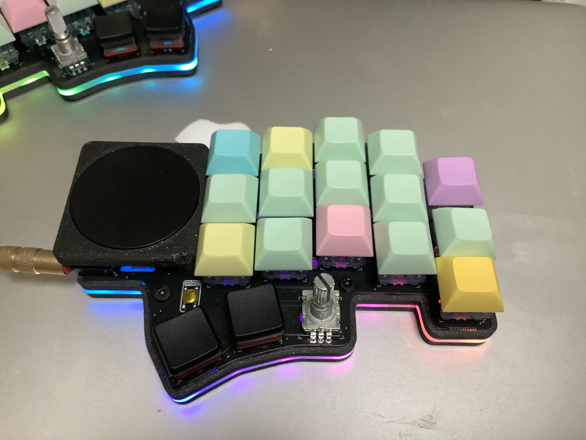
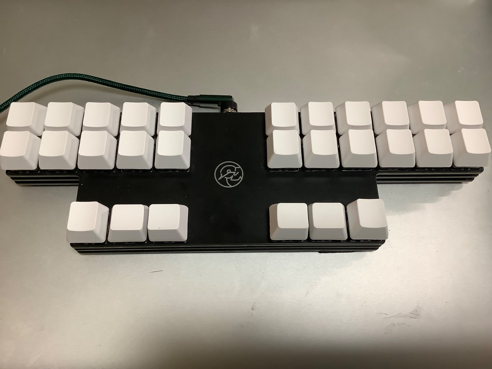
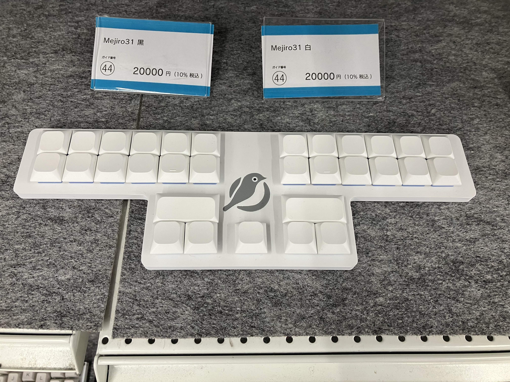
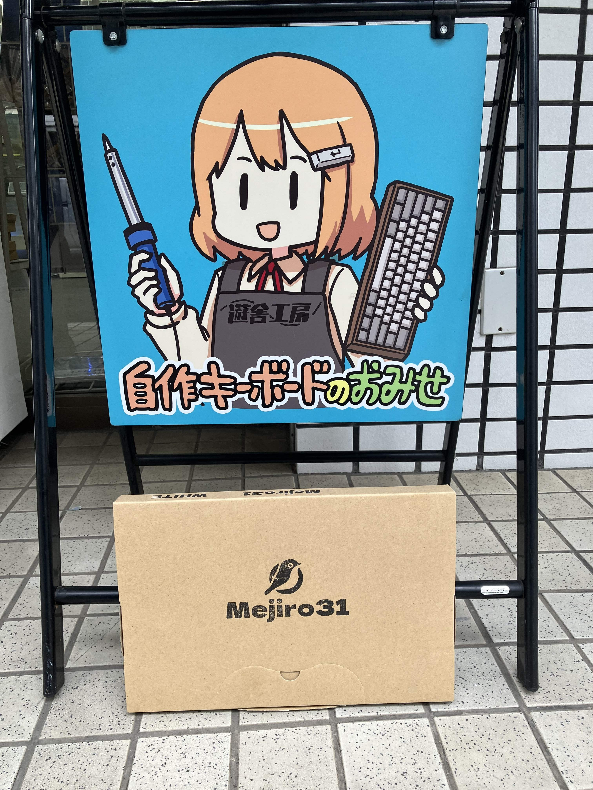
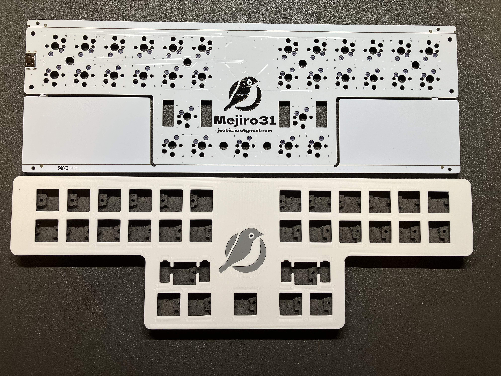
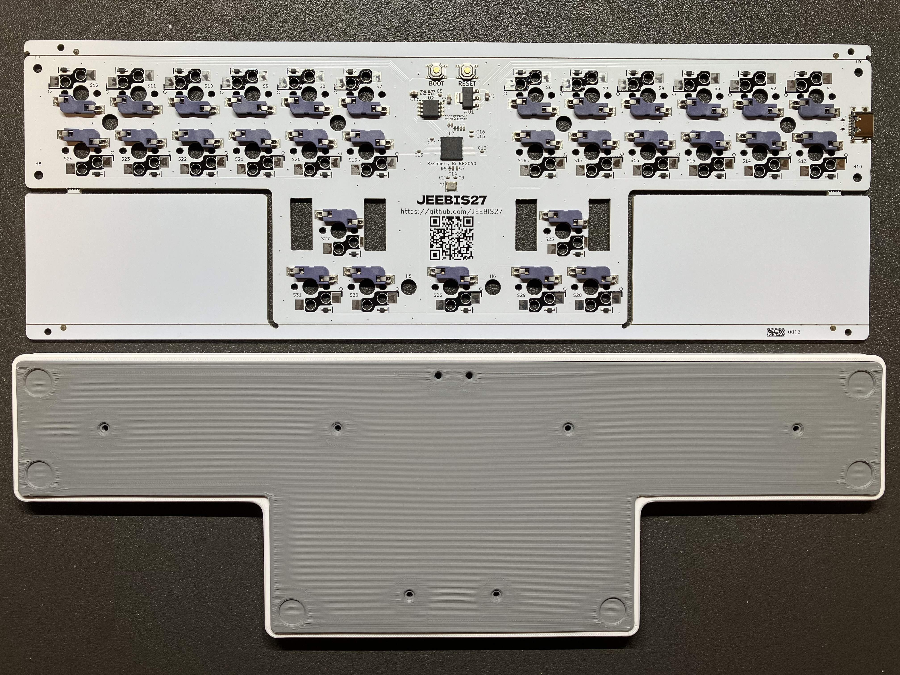
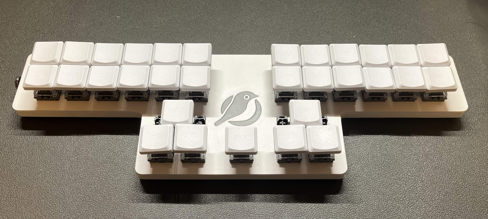
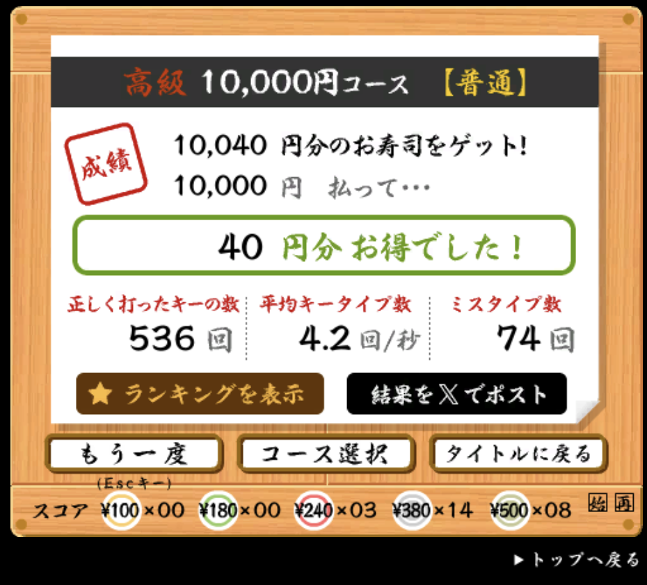

#+TITLE: Mejiro31 キーボード
#+DATE: <2026-03-21 Sat>
#+FILETAGS: :keyboard:steno:

* 背景

[[https://shop.yushakobo.jp/products/11895][Mejiro31 キーボード]] を購入しました。かなり特殊なキーボードですが、なぜこれが嬉しかったか、背景から記載します。

** 34 キー QWERTY

[[https://bastardkb.com/product/dilemma-built-v3/][Dilemma]] をメインのキーボードにしています。 34 キーの QWERTY 配列で、操作性の良さは極値にあります。しかし一年間使っていると、飽きを感じて来ました:

#+CAPTION: [[https://bastardkb.com/product/dilemma-built-v3/][Dilemma]] V2 キーボード (右手部分)

このキーボードは (なぜか光っていて) お気に入りですが、操作方法が普通過ぎました。ここから先は、指の動かし方を変えなければ満足できません。

** 英語速記

Dilemma の次は [[https://stenokeyboards.com/products/the-uni-v4][Uni V4]] を買って『速記』を練習していました。当時は Uni が在庫切れだったため、 Discord 経由で異国の誰かに譲って頂いた思い出があります:

#+CAPTION: Uni V4

英語速記の [[https://lapwing.aerick.ca/][Lapwing]] では、以下のストロークで =git= を入力します。かなり特殊な指の動かし方を経験でき、キーボード操作に満足できました:

#+BEGIN_STENO
TKPW-EUT
#+END_STENO

しかし今度は習得難度があまりにも高く、半年以上経った現在においても、入力できない単語の方が多いほどです。結果、 34 キー QWERTY 配列を使っている時間が圧倒的に長く、僅かな練習時間のみ速記を使っていました。

** 24 キー QWERTY

以上の背景を踏まえると、 Mejiro31 の登場がいかに嬉しいものであったかご理解頂けると思います！

Mejiro31 は、二段分しかキーが無いにも関わらず、 QWERTY 配列を表現できるキーボードです。このために [[https://note.com/jeebis_keyboard/n/ncbc327906050][二段圧縮]] と命名されたアイデアを採用しており、しかも Uni と同様に速記キーボードとして使うこともできます。

つまり *QWERTY のメンタルモデルを保ったまま新しいキーボードの操作性を提供* し、かつ *いつでも速記ができる* 夢のキーボードだったのです。 𝑃𝑒𝑟𝑓𝑒𝑐𝑡𝑖𝑜𝑛..!

* Mejiro31

** 購入

初回の在庫は、突如 [[https://shop.yushakobo.jp/products/11895][遊舎工房]] に入荷されました:

#+BEGIN_EXPORT
<blockquote class="twitter-tweet">
Mejiro31はなんと&quot;明日&quot;販売開始予定です！！！  遊舎工房さん（<a href="https://twitter.com/yushakobo_shop?ref_src=twsrc%5Etfw">@yushakobo_shop</a> ）の委託キーボードとして配売されます。 初回なので ・白5個 ・黒5個 だけの在庫となっています。<a href="https://t.co/xoFuT3JKbA">https://t.co/xoFuT3JKbA</a><a href="https://twitter.com/hashtag/Mejiro31?src=hash&amp;ref_src=twsrc%5Etfw">#Mejiro31</a> <a href="https://twitter.com/hashtag/%E8%87%AA%E4%BD%9C%E3%82%AD%E3%83%BC%E3%83%9C%E3%83%BC%E3%83%89?src=hash&amp;ref_src=twsrc%5Etfw">#自作キーボード</a>
&mdash; じーびす/ʐiːbɪs/ (@jeebis_iox) <a href="https://twitter.com/jeebis_iox/status/2028409114901291090?ref_src=twsrc%5Etfw">March 2, 2026</a></blockquote> 
#+END_EXPORT

在庫 10 に対して like の数が 10 を超えており、ステルス勢も必ずいます。争奪戦が予期されたため、直接店舗に赴きました:

#+CAPTION: Mejiro31 を発見！

#+CAPTION: 購入！ かわいい！

実際、オンライン販売の開始直後に売り切れたようです。オンライン販売開始までに時間差があるため、現地で買った方が安心ですね ♡

#+BEGIN_EXPORT html
<blockquote class="twitter-tweet">
ぎゃ〜！完売！15分くらいで完売しました！ 追加の在庫を用意するため、製造準備を開始いたします！
&mdash; じーびす/ʐiːbɪs/ (@jeebis_iox) <a href="https://twitter.com/jeebis_iox/status/2028721852508680583?ref_src=twsrc%5Etfw">March 3, 2026</a></blockquote> 
#+END_EXPORT

** 組み立て

開封直後、基板が信じられないくらい格好良いです。写真ではカリスマが薄れていますが、薄くて横長なのが洗練されています:

#+CAPTION: 上が基板、下がケース

#+CAPTION: 背面

組み立て作業はハンダ付け無しで完了してしまいました。設計次第でそこまでユーザーフレンドリーになるものなのですね。

#+CAPTION: 組み立て完了

#+BEGIN_QUOTE
親指の 2U (横広) キャップを付けておらず、未完です
#+END_QUOTE

** 二段圧縮の速度

初日の [[https://sushida.net/][寿司打]] では 10,000 点強となりました。以前のキーボードでは 15,000 点を切ることがなかったため、スピード面はかなり練習が必要です:

#+ATTR_HTML: :width 50%

特に上下 2 キーの同時押しの入力ミスが多く、なかなか難しいと思います。スピードが必要無ければ、問題無く入力可能でした。

** 設定 (QMK)

Mejiro31 は QMK ファームウェアを使って実装されています。かなりユニークで強力な機能が揃っていますが、僕の用途に向けてカスタマイズするのは困難でした。

幸い QMK の設定方法を理解できたので、 [[https://github.com/toyboot4e/qmk_firmware][僕のフォーク]] でキーマップを設定しました。レイヤが 4 つある至って普通の QMK キーボードですが、縦方向のコンボで二段圧縮を実装しているのと、速記レイヤに対応しています。

Mejiro31 のおかげで QMK にも入門できて最高です。僕の設定内容がそこまで複雑でないのは確かなのですが、 QMK の設定方法を初見で理解するのは難しかったです。 Mejiro31 のデフォルト設定が無いと厳しかったと思います。

#+BEGIN_QUOTE
速記プロトコルには QMK に未実装の Plover HID を使った方が良いです。 [[https://github.com/opensteno/qmk][opensteno/qmk]] には Plover HID が実装されているため、こちらを真似できないか試してみたいです。
#+END_QUOTE

** ポイティングデバイス

小さいトラックパッドを中央に置きたいのですが、該当する製品は未検討です:

Mejiro31 作者のじーびすさんは、 [[https://costory.jp/cf-published-sku-groups/1254312814][Nape Pro]] を検討されているそうです。やはり、何から何まで僕の先を行かれている方ですね……！

* まとめ

[[https://shop.yushakobo.jp/products/11895][Mejiro31 キーボード]] を購入しました。普段のキーボードの操作性が一新され、しかも速記との距離も近づきました。また Mejiro31 は一般への普及も狙った非常に野心的なキーボードであり、その意思にも大きな影響を受けました:

- 二段圧縮
  Mejiro31 は単なる速記キーボードの域を超え、通常のキーボードとしても素晴らしいものになりました。僕もこの操作性は楽しいです。
- 横方向のコンボ
  横 2 キーの同時押しで、たとえば Haskell で頻出の =->= を一打で打てるようにすると便利です。可能性が広がりました。
- US/JIS 配列の両対応
  Mejiro31 のデフォルトファームウェアでは、 OS のキーボード配列 (US/JIS) に依らず一定の記号を出力することができます。僕は自分の設定に移行した際にこの機能を失ってしまいましたが、有用だと思います。
- その他
  その他、キーボード配列の切り替えなど、僕には必要無いほど高度な機能が多数作り込まれていました。素晴らしいですね。

惜しむらくは在庫切れでしょうか。二段圧縮や速記レイヤ (Gemini PR) は QMK ファームウェアの標準的な機能で設定可能ですから、 Uni V4 など他のキーボードに実装して使ってみると良いかもしれません。

この記事は Mejiro31 を使って書きました。

