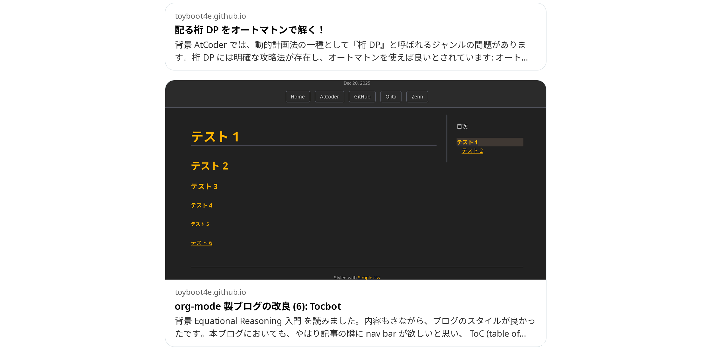
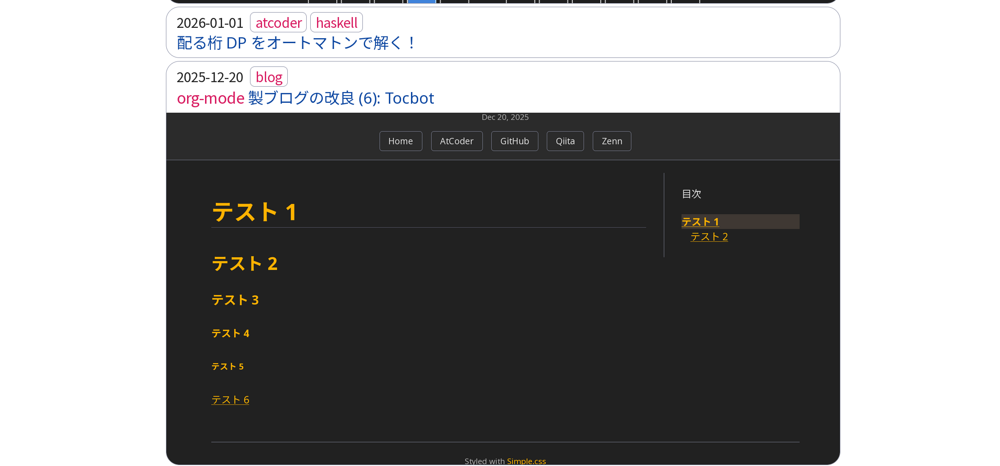

#+TITLE: =org-mode= 製ブログの改良 (8): OGP 対応、サムネイル追加
#+DATE: <2026-06-15 Mon>
#+FILETAGS: :blog:
#+THUMBNAIL: img/2026-06-15-og-preview.png

* 背景

手作業で作ってきたこのブログにも、 AI エージェントの手を入れ始めました。今回はベタ打ちだった [[https://ogp.me/][OGP]] タグを更新し、記事ごとにサムネイル画像および説明文を設定しました。

* 変更内容

** OGP 画像への対応

各記事の FILETAG (org-mode における frontmatter) にサムネイル画像を指定できるようにしました:

#+BEGIN_SRC diff-org
,#+TITLE: =org-mode= 製ブログの改良 (8): サムネイル、 OGP 対応
,#+DATE: <2026-06-15 Mon>
#+FILETAGS: :blog:
+#+THUMBNAIL: img/2026-06-15-og-preview.png
#+END_SRC

OGP 画像の見た目は [[./og-preview.html]] から確認できます。現時点では、以下のように表示します:

#+BEGIN_QUOTE
#+CAPTION: 上: サムネイル無し、下: サムネイル有り

#+END_QUOTE

幸い、サムネイルの専用画像を生成せずとも、記事中の画像ファイルを指定すれば自動的に縮小・トリミングして表示してくれるようです。

** トップページの更新

トップページも同様にサムネイルを表示し、枠を丸めてみました:

#+BEGIN_QUOTE
#+CAPTION: 上: サムネイル無し、下: サムネイル有り

#+END_QUOTE

サムネイル画像が枠にフィットしており、なかなか見応えがあるのではないでしょうか。タイトル部分が見栄えしないため、まだ調整は必要そうです。どう直せば良いか分からないので、しばらくこのままになりそうですが……。

* まとめ

OGP 画像を設定し、合わせてトップページの見た目を大幅に改善することができました。記事のカード表示にはモバイルを思わせるチープさがありましたが、画像が入ることで一気にセンスが良くなったと思います。

今意識しているブログは、 [[https://atree4728.github.io/][atree4728]], [[https://technicalsuwako.moe/][テクニカル諏訪子]] 、そして昨日始まった [[https://ose20.com/][Light for the Afflicted]] です。やはり行あたりの文字数が多いほど重厚さが増し、文豪のような凄みが生まれると思います。

僕のブログもサクサク読める媒体としては良いレイアウトになっていると思いますが、果たして *No. 1* になったと思える日は来るのでしょうか。今後もじわじわと改善して行きましょう。
