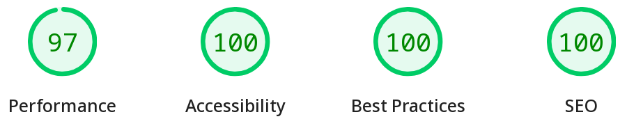
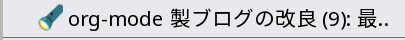
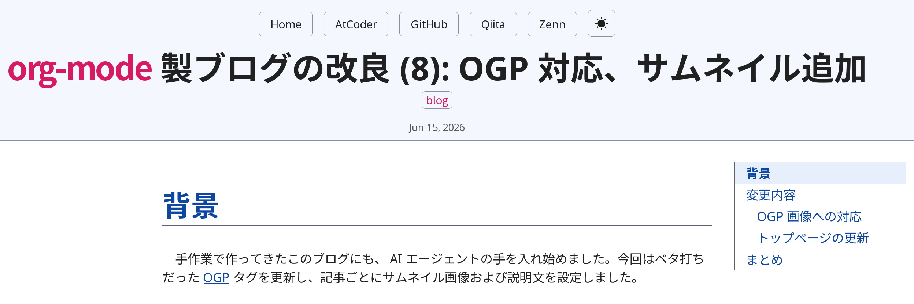
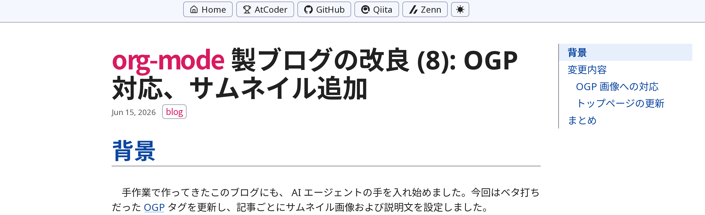

#+TITLE: =org-mode= 製ブログの改良 (9): 最適化、リンクカード他
#+DATE: <2026-06-17 Mon>
#+FILETAGS: :blog:
#+THUMBNAIL: img/2026-06-17-lighthouse-thumbnail.png

* 背景

前回の投稿でサムネイルを表示し、重くなったブログを高速化しました。概ね AI エージェントがやってくれました。

#+CAPTION: [[https://developer.chrome.com/docs/lighthouse/overview][Lighthouse]] の結果

しかも積んでいたタスクが一気に片付けられてしまいました。 AI の偉大な進捗をメモしておきます。

* 最適化

** Lighthouse

まず =Justfile= から [[https://developer.chrome.com/docs/lighthouse/overview][Lighthouse]] を起動できるようにしました。 Accessibility 等は静的サイトのため 100 点でしたが、パフォーマンスが 60 点ほどに低下していました。改善して行きます。

** ファイルサイズの削減

*** WebP 変換

画像を webp に変換しました。これだけで 50% 以下に容量を削減できました。

サムネイルは最初の一枚のみを即座に読み込み、他の画像は遅延することにしました。このため LCP (Largest Contentful Paint) が素早くなります。 Lighthouse の評価をハックしている感はありますが、実際にユーザ体験も良くなれば幸いです。

*** CSS の最小化

=esbuild= で CSS を最小化しました。ベンチマーク上は、意外と効いているらしいです……？

** Post processing

*** MathJax → KaTeX

[[https://www.mathjax.org/][MathJax]] は JS 1 つで動いてくれるのが魅力ですが、 SVG 出力が静的生成に不利です。 [[https://katex.org/][KaTeX]] の出力は HTML であり、 CSS とフォントで描画できます。

*** Prism.js

[[https://prismjs.com/][Prism.js]] を事前実行しました。これで Prism.js の豊富な機能を利用しつつも、ランタイムコストはゼロ (CSS のみ) になりました。

HTML の加工スクリプトでは、概ね [[https://github.com/WebReflection/linkedom][linkedom]] でパースしています。 coderef が絡むコードブロックは linkedom でパースできなかったため、 [[https://github.com/capricorn86/happy-dom][happy-dom]] でパースしました。

#+CAPTION: coderef とは？
#+BEGIN_SRC typescript
const itIs = this; // (ref:1)
#+END_SRC

- [[(1)]]: これが coderef です

*** Optional な JS/CSS の検出

テンプレート処理中で、特定の要素に応じて =<link>= タグを設定するように変更しました。たとえば =$\LaTeX$= と書けば、 =org-mode= は以下の math fragment に展開します:

#+BEGIN_SRC html
\(\LaTeX\)
#+END_SRC

ビルドスクリプト中で =\(=, =\[=, =\begin= といった math fragment を検出した場合に、 $\KaTeX$ フォントおよび CSS に =<link>= します。また math fragment は HTML に変換されます:

#+BEGIN_SRC html

  ...
  ...

#+END_SRC

* 機能追加

*** =#+DRAFT= 記事

記事の FILETAG に =#+DRAFT: t= を書くと、ローカルビルド以外からは除外されます:

#+BEGIN_SRC diff-org
,#+TITLE: =org-mode= 製ブログの改良 (9): 最適化
,#+DATE: <2026-06-15 Mon>
+#+DRAFT: t
#+END_SRC

*** =favicon.ico=

devtool や Lighthouse にも指摘されていた =favicon.ico= を設定しました。ブラウザタブでの視認性が良くなったと思います。

#+CAPTION: ブラウザタブにおける =favicon.ico=

*** ヘッダ

元は [[https://simplecss.org/][Simple.css]] の慣例通り、ヘッダ内にタイトルを入れていました:

#+CAPTION: 変更前

Sticky header の方が操作性が良いため、レイアウトを変更しました:

#+CAPTION: 変更後

タイトルの感じは [[https://mizunashi-mana.github.io/blog/][続くといいな日記]] を参考にしました。『記事』っぽくて良いのではないでしょうか。

*** リンクカードの展開

[[https://orgmode.org/manual/Adding-Hyperlink-Types.html][Custom link type]] として =card= を追加しました:

#+BEGIN_SRC org
[[card:https://toyboot4e.github.io]]
#+END_SRC

上記は =build.el= の =:export= ハンドラによって、以下のプレースホルダ =<a>= タグに展開します:

#+BEGIN_SRC html
<a class="link-card" href="https://toyboot4e.github.io" data-link-card>https://toyboot4e.github.io</a>
#+END_SRC

=postprocess.ts= が OGP 情報を使って、リンクカードへ展開します:

#+BEGIN_SRC html
<a class="link-card" href="https://toyboot4e.github.io" target="_blank" rel="noopener">
  
    Toybeam
    Devlog of toyboot4e
    
      
      Toybeam
    
  
</a>
#+END_SRC

以下、例です:

[[card:https://toyboot4e.github.io]]

[[card:https://toyboot4e.github.io/2026-03-14-light-theme.html]]

[[card:https://github.com/toyboot4e/toyboot4e.github.io]]

[[card:https://zenn.dev/catnose99/articles/nani-translate]]

GitHub のインラインリンクも実装してくれました:

[[card:https://github.com/toyboot4e/toyboot4e.github.io/blob/c0b6beaf6ec6a4123b82e0217db43cd98b4569db/build.el#L923-L925]]

* まとめ

片手間に AI と会話するだけで完成してしまいました。今となっては、 =org-mode= でブログ生成しているのは正攻法とさえ言えるかもしれません。

けっこう『ちゃんとした』ブログに見えてきましたね。コミット内容は未確認ですから、後ほど確認して行きます……!!

