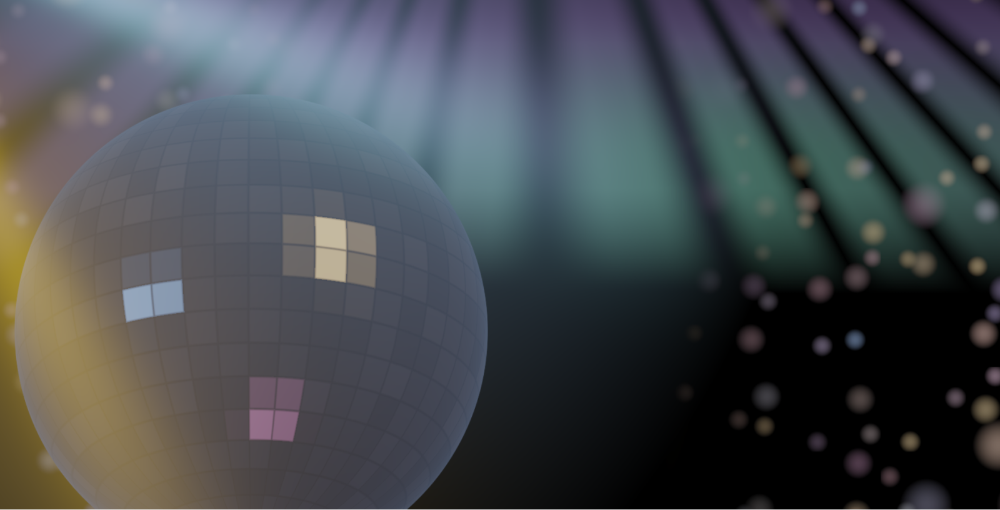
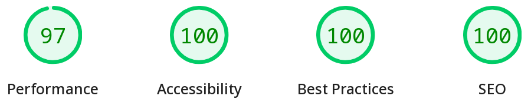

#+TITLE: =org-mode= 製ブログの改良 (10): WebGL 🪩, Uniorg
#+DATE: <2026-06-24 Wed>
#+FILETAGS: :blog:
#+THUMBNAIL: img/2026-06-22-disco-ball.webp

* 背景

ブログ生成 vibe coding シリーズです。

* 変更

** WebGL 🪩

このブログでミラーボール (ディスコボール) が回るようになりました:

#+CAPTION: ついに……！

上方の灯りは、オーロラを参考画像として生成してもらいました。画像認識が強いですね。

普及性のため、 WebGPU ではなく WebGL で描画しています。 GPU が検出できない場合は非表示となります。

** Uniorg

ビルドに Emacs を使うのをやめ、 TypeScript 製の org パーサである [[https://github.com/rasendubi/uniorg][Uniorg]] に移行しました。 macs の起動を待つ必要が無くなったため、ビルドを高速化できました。

一点のみ [[https://github.com/rasendubi/uniorg/pull/153][PR]] を送りましたが、 battle-tested なパーサだったように思います。 Regex のコンパイルはキャッシュした方が良いかも。

#+BEGIN_DETAILS 主な構文のテスト (=test=, $KaTeX$)
Golden/snapshot テストもありますが、一応この記事でマークアップの変換結果を確認しておきます。

Inline $KaTeX$,

#+CAPTION: Block $KaTeX$
$$
\mathcal{F} = m \ddot{\mathbb{x}}
$$

#+CAPTION: [[https://developer.chrome.com/docs/lighthouse/overview][Lighthouse]] の結果

#+CAPTION: width 250 px (ATTR\under{}HTML)
#+ATTR_HTML: :width 250px

[[card:https://github.com/toyboot4e/toyboot4e.github.io]]

[[card:https://zenn.dev/catnose99/articles/nani-translate]]

[[card:https://github.com/toyboot4e/toyboot4e.github.io/blob/c0b6beaf6ec6a4123b82e0217db43cd98b4569db/build.el#L923-L925]]

#+CAPTION: org-mode highlight =test=, $KaTeX$ (TODO: re-impl)
#+BEGIN_SRC org
,#+TITLE: =org-mode= 製ブログの改良 (10): Uniorg
,#+DATE: <2026-06-24 Wed>
,#+FILETAGS: :blog:
#+END_SRC

#+BEGIN_SRC diff-javascript
// Diff
+ const f = () => 42;
+ const g = () => 42; // (ref:1)
abc;
#+END_SRC

- [[(1)]] coderef

#+CAPTION: coderef
#+BEGIN_SRC org
The document must allow coderef # (ref:1)
#+END_SRC

- [[(1)]] coderef

#+BEGIN_YARUO
　　　　　　　　　　　　　　　　　　　　 　 　 　 　 .|　　　　　 　 　 /
　　　　　　　　　　　　　　　　 　 　 　 　 　 　 　 !　　　　　　　 /
　　　　　　　　　　　　　　　　　　　　 　 　 　 　 .l　　　　＿＿/_
　　　　　　　　　　　　　　　　 　 　 　 　 　 　 　 !　　 ／　　/　＼
　　　　　　　　　　　　　　　　 　 　 　 　 　 　 　 !　／. 　　/ _ノ　 ＼
　　　　　　　　　　　　　　　　　　　　 　 　 　 　 .l │. 　　/（● ）（●）　　　　俺が見えるか！
　　　　　　　　　　　　　　　　　　　　 　 　 　 　 .| │　　/　　（__人__）
　　　　　　　　　　　　　　　　 　 　 　 　 　 　 　 ! │.　/ 　 　｀ ⌒´ﾉ
　　　　　　　　　　　　　　　　 　 　 　 　 　 　 　 ! │ /　　 　 　 　 }
　　　　　　　　　　　　　　　　 　 　 　 　 　 　 　 | ノ./ヾ.ﾍ　　　　　}
　　　　　　　　　　　　　　　　　　　　 　 　 ..=ｨﾞﾆ|　/､;i;i;ヾヘ　　_ノ
　　　　　　　　　　　　　　　.　　　　 　 : :イ/{ ／￣ヾ}l!;i;i;iLc､＞
　　　　　　　　　　　　　　　.　　　　 　 / '/,ﾑ{　∧　 }ｰ-,-､《;i〈
　　　　　　　　　　　　　　　.　　　　 　 !:.,'〃´ﾊ｛/　 ﾊ::〃,=ヾﾐ;i
　　　　　　　　　　　　　　　.　　　　 　 :.:{/' 〃ﾞヽ__ノヽi/´　　 }＼
　　　　　　　　　　　　　　　.　　　　 　 :.:|!､/　　ヽ::Y::/{　　r､/ﾑ .＼
　　　　　　　　　　　　　　　.　　　　 　 !:.!ﾑ　　　 ヽj::ノ{ 　 | ,';i;iﾑ 　 ヽ.
　　　　　　　　　　　　　　　.　　　　 　 Ⅵﾏ＼　　_ ヽ';i乂__.ｿ;i;i;i;i| 　 　 丶
　　　　　　　　　　　　　　　.　　　　 　 ﾄj0l|Y´＼{ }　 Y;i;i;i;i;i;i;i;i;i;iﾄ，　　 　 ＼
　　　　　　　　　　　　　　　.　　　　 　 `!0j;iﾄ､　 ヾ__.人;i;i;i;i;i;i;i;i;i;i;{ 　 　 　 　 ＼
　　　　　　　　　　　　　　　.　　　　 　 〈ｿ,∧　＼　 「 ! Y;i;i;i;i;i;i;i;i;iﾑ
　　　　　　　　　　　　　　　.　　　　　 　 j､;i;i;､　　＼___丿;i;i;i;i;i;i;i;i;i;iﾑ
　　　　　　　　　　　　　　　.　　　　 　 /.:::∨;i;i`i.､___ﾉ;i＼;i;i;i;i;i;i;i;i;i;i;ｉﾑ
　　　　　　　　　　　　　　　.　　　　 　 ::::::::.∨;i;i|:;i;i;i;i;i;i;i;ｉ;＼;i;i;i;i;i;i;i;i;i;ﾑ
　　　　　　　　　　　　　　　.　　　　 　 ､_:::::::∨;i|:;i;i;i;i;i;i;i;i;i;i;i;丶:;i;i;i;i;i;i;i;ﾑ
　　　　　　　　　　　　　　　.　　　　 　 ::ｰﾆ=ｲ};i:!:;i;i;i;i;i;i;i;i;i;i;i;i;i;i＼:;i;i;i;i;i;i;i〉
　　　　　　　　　　　　　　　.　　　　 　 ヽ:::::::::ﾉ;i:!:;i;i;i;i;i;i;i;i;i;i;i;i;i;i;i;i;i＼:;i;i;/
　　　　　　　　　　　　　　　.　　　　　 　 ヽ／;ｉ;i:|:;i;i;i;i;i;i;i;i;i;i;i;i;i;i;i;i;i;i;i;i＼:〉
　　　　　　　　　　　　　　　.　　　　 　 ..／;i;i;i;i;i:|:;i;i;i;i;i;i;i;i;i;i;i;i;i;i;i;i;i;i;i;ｉ;ｉ;ｉ;＼
　　　　　　　　　　　　　　　.　　　　 　 ,ゝ;i;i;i;i;i;ｉ:|:;i;i;i;i;i;i;i;i;i;i;i;i;i;i;i;i;i;i;i;i;i;i/　 丶
　　　　　　　　　　　　　　　.　　　　 　 i;i;i;i;i;i;i;i;ｉ:|:;i;i;i;i;i;i;i;i;i;i;i;i;i;i;i;i;i;i;i;i;/　　　　＼
　　　　　　　　　　　　　　　.　　　　 　 i;i;i;i;i;i;i;ｉ;ｉ:!:;i;i;i;i;i;i;i;i;i;i;i;i;i;i;i;i;i;i;i∧
　　　　　　　　　　　　　　　.　　　　 　 i;i;i;i;i;i;i;ｉ;ｉ:!:;i;i;i;i;i;i;i;i;i;i;i;i;i;i;i;i;i;i/. ﾑ
　　　　　　　　　　　　　　　.　　　　 　 i;i;i;i;i;i;i;i;ｉ:ｌ:;i;i;i;i;i;i;i;i;i;i;i;i;i;i;i;i;i/／ﾏ___
　　　　　　　　　　　　　　　.　　　　 　 ､i;i;i;i;i;i;i;i:|:;i;i;i;i;i;i;i;i;i;i;i;i;i;i;i;i;}/イ;;;;;;;;;`!
　　　　　　　　　　　　　　　.　　　　 　 ';i;i;i;i;i;i;i;ｉ:ｌ:;i;i;i;i;i;i;i;i;i;i;i;i;i;i;i;iﾑ.;;;;;;;;;;;;;;;;;〉
#+END_YARUO

#+END_DETAILS

* まとめ

背景で 🪩 が回るようになりました。馬鹿げているほど良いですが、すこしシリアスに見えるかもしれません。

=org-mode= 製ブログが TypeScript 製になりました。ビルド時間が 4.2s から 1.6s まで短縮した他、 JSX で HTML を生成できるなど、メリットが大きいです。

