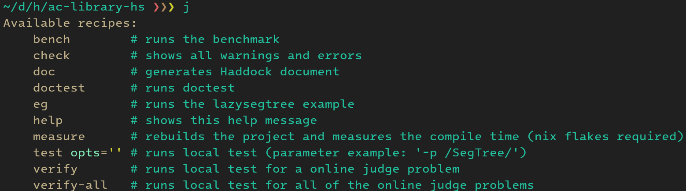

#+TITLE: ABC 389, =Justfile=, 競プロ盆栽.hs
#+DATE: <2025-01-19 Sun>

* ABC 389

[[https://atcoder.jp/contests/abc389][ABC 389]] に参加しました。後半は高 diff 二分探索の良問だった模様です。

#+CAPTION: Diff 予想
| 問題       | A 問題 | B 問題 | C 問題 | D 問題 | E 問題 | F 問題 |
|------------+--------+--------+--------+--------+--------+--------|
| 提出       |     AC |     AC |     AC |     AC | -      | -      |
| 体感 diff |     10 |    100 |    400 |    600 | 1,200  | 1,600  |
| 実際 diff |      8 |     25 |    255 |    749 | 1,897  | 1,642  |

** [[https://atcoder.jp/contests/abc389/tasks/abc389_a][A 問題]]

文字列 =AxB= が与えられたとき、 =A * B= を計算せよ。パターンマッチします:

#+BEGIN_SRC haskell
solve :: StateT BS.ByteString IO ()
solve = do
  [!a, !_, !b] <- BS.unpack <$> line'
  printBSB $ digitToInt a * digitToInt b
#+END_SRC

** [[https://atcoder.jp/contests/abc389/tasks/abc389_b][B 問題]]

整数 $X$ が与えられとき、 $N! = X$ となる $N$ を求めよ。遅延評価の出番です:

#+BEGIN_SRC haskell
solve :: StateT BS.ByteString IO ()
solve = do
  !x <- int'
  printBSB $ fromJust $ elemIndex x $ scanl' (*) (1 :: Int) [1..]
#+END_SRC

** [[https://atcoder.jp/contests/abc389/tasks/abc389_c][C 問題]]

キューに要素追加・削除していく時、キューの中で $k - 1$ 番目の要素の累積和を求めよ。先に全要素の累積和配列を作っておけば、 pop 回数 $\mathrm{nPop}$ を用いて $S[k + \mathrm{nPop}] - S[\mathrm{nPop}]$ が答えになります。

まずクエリをパースします:

#+BEGIN_SRC haskell
solve :: StateT BS.ByteString IO ()
solve = do
  !q <- int'
  !qs <-
    U.replicateM q $
      int' >>= \case
        1 -> (1 :: Int,) <$> int'
        2 -> pure (2 :: Int, -1)
        3 -> (3 :: Int,) <$> int'
        _ -> error "unreachable"
#+END_SRC

Push クエリを先読みし、累積和配列を作ります:

#+BEGIN_SRC haskell
  let (!spawns, !other) = U.partition ((== 1) . fst) qs
  let pos = dbgId $ U.scanl' (+) (0 :: Int) $ U.map snd spawns
#+END_SRC

=unfoldr= でクエリ =3= の答えを作ります:

#+BEGIN_SRC haskell
  let res = U.unfoldr f (0 :: Int, other)
        where
          f :: (Int, U.Vector (Int, Int)) -> Maybe (Int, (Int, U.Vector (Int, Int)))
          f (!nPop, !qs_) = do
            (!q, !rest) <- U.uncons qs_
            case q of
              (1, !_) -> f (nPop, rest)
              (2, !_) -> f (nPop + 1, rest)
              (3, pred -> k) -> pure (pos G.! (k + nPop) - pos G.! nPop, (nPop, rest))

  printBSB $ unlinesBSB res
#+END_SRC

** [[https://atcoder.jp/contests/abc389/tasks/abc389_d][D 問題]]

半径 $r$ の円に内包される正方形の数を数えよ。第一象限 ($Q_1 = \{ (x, y) \mid x > 0, y > 0 \}$) 中のカウントを 4 倍し、 X, Y 軸上の正方形の数を足すと答えになります。行ごとに右端の正方形の位置を二分探索すれば、 $O(r \log r)$ で解答できます。

#+BEGIN_SRC haskell
-- | 正方形の 4 点と原点の間の距離が r 以下ならば true
testPoint :: Int -> Int -> Int -> Bool
testPoint r y x = all (<= 4 * r * r) [d1, d2, d3, d4]
  where
    y2 = 2 * y + 1
    y1 = 2 * y - 1
    x2 = 2 * x + 1
    x1 = 2 * x - 1
    dist a b = a * a + b * b
    d1 = dist y1 x1
    d2 = dist y1 x2
    d3 = dist y2 x1
    d4 = dist y2 x2

-- | 行をカウント
solveRow :: Int -> Int -> Int
solveRow r y = fromMaybe 0 $ bisectL 0 r $ \x -> testPoint r y x

-- | 四分円をカウント
solveQuater :: Int -> Int
solveQuater r = sum [solveRow r y | y <- [1 .. r + 1]]

-- | 円全体をカウント
f :: Int -> Int
f r = solveQuater r * 4 + 4 * (r - 1) + 1

solve :: StateT BS.ByteString IO ()
solve = do
  !r <- int'
  printBSB $ f r
#+END_SRC

** [[https://atcoder.jp/contests/abc389/tasks/abc389_e][E 問題]]

頑張って解説 AC するかも……？

** [[https://atcoder.jp/contests/abc389/tasks/abc389_f][F 問題]]

頑張って解説 AC するかも……？

* Misc

** just

[[https://toyboot4e.github.io/2025-01-18-task-runners.html][お試しタスクランナー]] の後、 =ac-library-hs= に =Justfile= を導入しました [[https://github.com/toyboot4e/ac-library-hs/commit/d74035fb2528c65a41833d1d8e7d61ec48558174][(該当のコミット)]] 。これが結構良い感じです。書き味良し、見た目良し！:

#+CAPTION: =Justfile= のコマンド一覧

#+CAPTION: テスト実行の例
#+BEGIN_SRC sh
$ j t # サブディレクトリからも実行可
#+END_SRC

ABC 環境にも導入しました ([[https://github.com/toyboot4e/abc-hs/commit/215a58db27301d2ec61c7fecf1ccce60b8c1553b][該当のコミット]]) 。リポジトリ毎に簡潔なコマンドレシピを持てるようになり、見通しが良くなったと思います。

=just= の解説は [[https://minerva.mamansoft.net/Notes/%F0%9F%93%9C%E3%82%BF%E3%82%B9%E3%82%AF%E3%83%A9%E3%83%B3%E3%83%8A%E3%83%BC%E3%81%AEjust%E3%82%92%E8%A9%A6%E3%81%97%E3%81%A6%E3%81%BF%E3%81%9F][📜タスクランナーのjustを試してみた - Minerva]] が良いです。 [[https://blog.tomoya.dev/][tomoya さんのブログ]] と同系統のレイアウトで、ページも格好いい。

** 言語アップデート 2025

[[https://github.com/haskell-hvr/cabal-plan][=cabal-plan=]] の =license-report= および gksato さんの [[https://github.com/gksato/haskell-atcoder-server-gen][server gen]] のおかげで、特に問題無く更新できそうです。最悪、 10 分あれば今すぐに更新を申請できます。良かった〜〜！

未だ天下の C++, Python の更新申請が無いので、新ジャッジ環境のテストは 2 月になると予想しています。今振り返ると、 [[https://github.com/toyboot4e/ac-library-hs][=ac-library-hs=]] を作り始めたタイミング (昨年 10 月) は、ちょうど十分な時間が得られて良かったと思います。十二分にバッファを取ったつもりでしたが、テストが重かったです。

** 競プロ盆栽.hs

=ac-library-hs= 開発は [[https://zenn.dev/toyboot4e/books/kyopro-bonsai-hs][競プロ盆栽.hs]] に載せています。直前まで =ac-library-hs= を弄っており、実はほぼ 3 日で書きました。ブログ替わりの [[https://github.com/toyboot4e/ac-library-hs/issues?q=is%3Aissue%20][Issue]] を下敷きにしたのが良かったです。

競プロ盆栽.hs は半分以上テストの話です。何と言っても QuickCheck が大活躍しました。サクっと乱数生成してエラー内容を確認できるのが嬉しい。要所のバグを早期確認できるのはもちろん、単位元やモノイド則のように明らかに重要な法則がある場合は効果抜群です。

気が早いですが、今年も Haskell のカレンダーに何か出したい気はします。順当に行くなら、 Heuristic コンテストでどれだけ戦えるかに興味があります。 Heuristic の能力を磨くのは相当しんどいはずですが、 CTF よりはマシです。やっていくのか……？？

